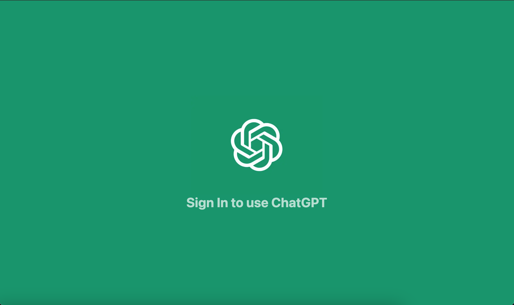
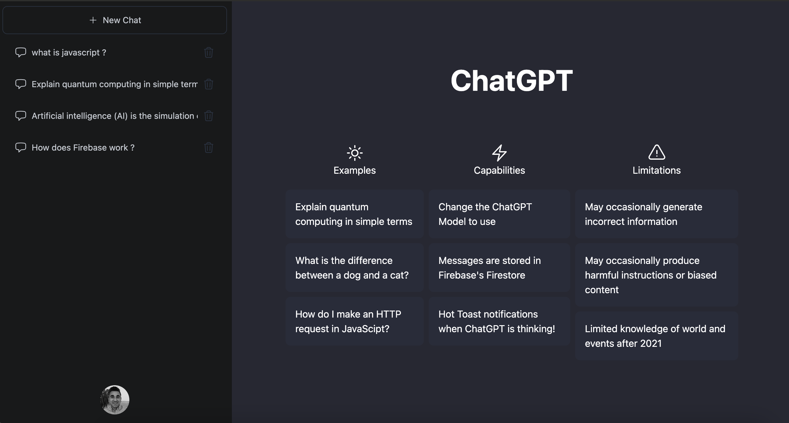
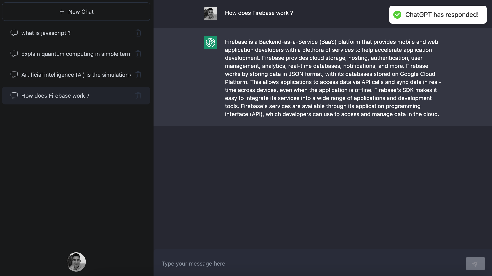

# Chat GPT

## **Overview** ☀️

In this project, I am working with Next.js 13 to build a mini version of ChatGPT Messenger, so I am learning how to use the new Next.js folder structure, which gives us server rendered components by default in the new app folder.

So far, I have created the homepage layout and the social login using Google.

Next up, I will be working on the Sidebar functionality, including realtime chat.

## **Tech Stack** 🚀

- React
- Next.js 13
- TypeScript
- OpenAI GPT3 API
- Firebase
- Cloud Firestore | NoSQL Cloud Database
- Next Auth
- Tailwind CSS

 

## **Screenshots** ⭐️

 

**Sign In:**

 

**Homepage:**

 

**ChatGPT:**

